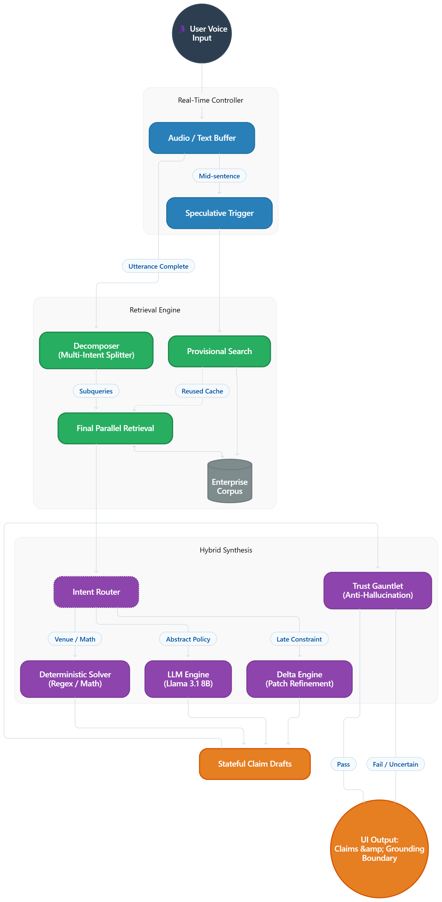

# 🛡️ Aegis

## Streaming Live RAG for Real-Time Conversational AI

> **Aegis is a stateful, low-latency RAG engine built for voice and
> streaming interfaces.** It starts retrieval while the user is still
> speaking, separates multi-intent requests, uses deterministic logic
> where LLMs are unreliable, and patches only the claims affected by a
> late constraint instead of rebuilding the entire answer.

**Hackathon:** PRISM_GENAI_HACKATHON_Y2026\
**Product:** Aegis\
**Theme:** Streaming Live RAG

------------------------------------------------------------------------

## Why Aegis?

Traditional RAG follows a simple sequence:

**User finishes speaking → retrieve → generate → answer**

That workflow is acceptable for ordinary chat, but it introduces
unnecessary latency and recomputation in conversational systems.

Aegis changes the execution model:

**User starts speaking → retrieve provisionally → decompose → retrieve
in parallel → synthesize by intent → preserve answer state → patch only
what changed**

This is the core idea behind **Streaming Live RAG**.

### The four problems Aegis targets

  -----------------------------------------------------------------------
  Problem                 What happens in         Aegis approach
                          conventional RAG        
  ----------------------- ----------------------- -----------------------
  **Voice latency**       Retrieval starts only   **Speculative retrieval
                          after the utterance     starts mid-utterance**
                          ends                    

  **Multi-intent          One context mixes       **Queries are
  queries**               unrelated evidence      decomposed and grounded
                                                  independently**

  **Late constraints**    The complete pipeline   **Delta Engine patches
                          runs again              only affected claims**

  **Hard numbers**        LLM may mix or invent   **Deterministic routing
                          numerical values        handles structured
                                                  constraints**
  -----------------------------------------------------------------------

------------------------------------------------------------------------

# ⚙️ How Aegis Works

Aegis treats an answer as a **stateful collection of grounded claims**,
not as disposable generated text.

### 1. Speculate

While the user is still speaking, the controller detects a useful
partial query and starts a **provisional retrieval**.

### 2. Decompose

When the utterance completes, compound requests are split into
independent sub-intents.

### 3. Retrieve

Each sub-intent gets targeted evidence from the enterprise corpus.
Previously retrieved provisional evidence can be reused when valid.

### 4. Route

The system determines how each claim should be solved:

-   **Structured / numerical constraint → deterministic solver**
-   **Abstract policy / language → isolated LLM context**
-   **Late constraint → Delta Engine**

### 5. Synthesize

The results become **stateful claim drafts** rather than one
unstructured answer.

### 6. Verify

The **Trust Gauntlet** checks grounding and rejects unsupported or
uncertain claims.

### 7. Present

The UI exposes the resulting claims together with their **grounding
boundary**, making uncertainty explicit instead of silently inventing an
answer.

------------------------------------------------------------------------

# 🏗️ Architecture

The repository contains the rendered architecture diagram below.

> **Keep `architecture_diagram.png` in the repository root.**



### Architecture at a glance

``` text
User Voice
    │
    ▼
Real-Time Controller
    ├── Audio / Text Buffer
    └── Speculative Trigger
            │
            ▼
      Retrieval Engine
    ┌─────────────────────────────┐
    │ Provisional Search          │
    │ Multi-Intent Decomposition  │
    │ Final Parallel Retrieval    │
    │ Enterprise Corpus           │
    └──────────────┬──────────────┘
                   │
                   ▼
          Hybrid Synthesis
    ┌─────────────────────────────┐
    │ Intent Router               │
    │ ├─ Deterministic Solver     │
    │ ├─ LLM Engine               │
    │ └─ Delta Engine             │
    └──────────────┬──────────────┘
                   │
                   ▼
          Stateful Claim Drafts
                   │
                   ▼
             Trust Gauntlet
                   │
                   ▼
       UI Output + Grounding Boundary
```

The detailed system architecture uses three central ideas: **speculative
provisional retrieval, hybrid synthesis, and stateful Delta Engine
refinement**. fileciteturn5file0L22-L28

------------------------------------------------------------------------

# 🚀 What Makes Aegis Different?

## 01 --- Speculative Provisional Retrieval

Aegis does not wait for the final transcript before doing useful work.

Retrieval can begin **mid-utterance**, allowing the system to overlap
user speech with retrieval work.

**Goal:** reduce perceived conversational latency.

------------------------------------------------------------------------

## 02 --- Multi-Intent Isolation

Consider:

> "Find a restaurant for an event in Mumbai and tell me the corporate
> pet policy."

Aegis does not treat this as one giant retrieval problem.

It separates the request into independent subqueries, retrieves evidence
for each, and keeps their contexts isolated.

This prevents evidence for one intent from contaminating another.

------------------------------------------------------------------------

## 03 --- Hybrid Synthesis

Not every problem should be given to an LLM.

Aegis routes different types of work to different mechanisms:

``` text
                    Query
                      │
                 Intent Router
                  /     |      \
                 /      |       \
        Structured   Abstract   Late Constraint
        Constraint    Policy
             │          │          │
             ▼          ▼          ▼
       Deterministic   LLM     Delta Engine
          Solver
```

For example, a venue-capacity constraint can be evaluated
deterministically rather than asking an LLM to reason about whether a
number satisfies a threshold.

The project architecture explicitly uses deterministic handling for
structured constraints and isolated LLM processing for abstract policy
queries. fileciteturn5file0L25-L28

------------------------------------------------------------------------

## 04 --- Delta Engine

This is the stateful refinement layer.

Suppose the user first asks:

> "Find a venue for my event."

Then adds:

> "Actually, I need to accommodate 500 people."

A conventional pipeline may regenerate the entire answer.

Aegis instead:

``` text
Existing Answer
      │
      ▼
Semantic Diff
      │
      ├── Unchanged claims ──► KEEP
      │
      └── Capacity claim ─────► RETRIEVE
                                      │
                                      ▼
                                  PATCH CLAIM
```

Only the affected claim is refreshed while the rest of the answer state
is preserved. fileciteturn5file0L98-L100

------------------------------------------------------------------------

## 05 --- Trust Gauntlet + Grounding Boundary

Aegis explicitly validates claims against retrieved evidence.

Each claim is associated with grounding information, and uncertain or
unsupported content can be isolated into the **Grounding Boundary**
instead of being presented as fact.

This is especially important for numerical constraints, where mixing
values from unrelated evidence can produce plausible-looking but
incorrect answers. fileciteturn5file0L104-L105

------------------------------------------------------------------------

# 🎬 Demo Scenarios

### Scenario 1 --- Multi-Intent Query

**User:**

> "I need a restaurant for an event in Mumbai and also tell me about the
> corporate pet policy."

**Aegis:**

-   Detects two intents
-   Retrieves evidence independently
-   Routes venue constraints through deterministic logic
-   Routes policy reasoning through the LLM
-   Produces isolated grounded claims

------------------------------------------------------------------------

### Scenario 2 --- Late Constraint

**User:**

> "Actually I need to accommodate 500 people."

**Aegis:**

-   Detects the new constraint
-   Identifies the affected claim
-   Performs targeted retrieval
-   Patches the venue claim
-   Preserves unrelated claims

The project report documents this refinement path as a sub-20 ms TTFT
scenario. fileciteturn5file0L98-L100

------------------------------------------------------------------------

### Scenario 3 --- Presentation / Reuse

If the user is only asking the system to present or restate information
already established, Aegis can reuse existing evidence rather than
unnecessarily performing another retrieval cycle.
fileciteturn5file0L101-L103

------------------------------------------------------------------------

### Scenario 4 --- Grounding Test

Aegis tests whether generated claims remain supported by retrieved
evidence.

Unsupported or uncertain claims are pushed toward the **Grounding
Boundary** rather than being silently accepted.
fileciteturn5file0L104-L105

------------------------------------------------------------------------

# 📊 Evaluation Results

The current evaluation results are:

  Metric                                                     Aegis   Naive Baseline           Target
  -------------------------------------- ------------------------- ---------------- ----------------
  Retrieval recall --- overall                           **91.0%**            91.7%            ≥ 80%
  Single-intent recall                                  **100.0%**           100.0%              ---
  Multi-intent recall                                    **78.8%**            80.3%              ---
  Answer groundedness                      **100% (39/39 claims)**              ---            ≥ 85%
  Fabricated document IDs                                    **0**              ---                0
  Median TTFT --- refine turn                          **11.2 ms**        122.15 ms   Below baseline
  Refine-turn retrieval reduction                        **42.9%**              N/A             \> 0
  Trust Gauntlet --- adversarial tests              **4/4 passed**              ---              ---

### What these numbers demonstrate

**11.2 ms median TTFT on refinement turns** demonstrates the value of
avoiding complete regeneration.

**42.9% lower retrieval activity on refine turns** demonstrates that the
system is not simply repeating the original pipeline.

**100% groundedness across 39 evaluated claims** and **0 fabricated
document IDs** demonstrate the grounding checks used in the evaluation.

------------------------------------------------------------------------

# 🧪 Technology Stack

  -----------------------------------------------------------------------
  Layer                               Technology
  ----------------------------------- -----------------------------------
  Language                            **Python 3.10+ / Asyncio**

  API / Backend                       **FastAPI + Uvicorn**

  Streaming                           **WebSockets**

  LLM                                 **Llama 3.1 8B via Ollama**

  Retrieval                           **Custom in-memory vector engine +
                                      chunk management**

  Embeddings                          **Local embedding model + cosine
                                      similarity**

  Deterministic processing            **Regex + exact token-overlap
                                      algorithms**

  Frontend                            **HTML / CSS / JavaScript**

  Runtime                             **Docker / Docker Compose**
  -----------------------------------------------------------------------

The project report specifies Python/Asyncio, FastAPI/Uvicorn, local
Llama 3.1 8B through Ollama, a custom in-memory vector engine, local
embeddings, and deterministic regex/token processing.
fileciteturn5file0L107-L113

------------------------------------------------------------------------

# ▶️ Run Aegis

## Option 1 --- Docker

``` bash
docker compose up --build
```

Then open:

``` text
http://localhost:8000
```

## Option 2 --- Local Python

Requires **Python 3.10+**.

``` bash
python -m venv .venv
```

### Windows

``` bash
.venv\Scripts\activate
```

### macOS / Linux

``` bash
source .venv/bin/activate
```

Install dependencies:

``` bash
pip install -r requirements.txt
```

Build the corpus index:

``` bash
python -m corpus.build_index
```

Start the server:

``` bash
uvicorn backend.main:app --reload
```

Open:

``` text
http://localhost:8000
```

## Optional --- Local LLM with Ollama

``` bash
ollama run llama3.1:8b
```

Set:

``` text
AEGIS_LLM_PROVIDER=ollama
```

If Ollama is unavailable, the project can fall back to deterministic
heuristic parsing rather than failing outright.

------------------------------------------------------------------------

# 📁 Project Structure

``` text
Aegis/
├── backend/
│   ├── controller.py
│   ├── decomposer.py
│   ├── pipeline.py
│   ├── synthesis.py
│   ├── suppression.py
│   └── retrieval/
│
├── corpus/
│   └── ...
│
├── frontend/
│   └── ...
│
├── eval/
│   └── ...
│
├── architecture_diagram.png
├── requirements.txt
├── Dockerfile
├── docker-compose.yml
└── README.md
```

### Core modules

  -----------------------------------------------------------------------
  Module                              Responsibility
  ----------------------------------- -----------------------------------
  `backend/controller.py`             Streaming controller, silence
                                      detection, drift gate, speculative
                                      dispatch

  `backend/decomposer.py`             Multi-intent decomposition and
                                      refine-turn classification

  `backend/retrieval/`                Retrieval and evidence selection

  `backend/synthesis.py`              Hybrid synthesis, Delta Engine,
                                      Trust Gauntlet

  `backend/suppression.py`            Presentation-only query handling
                                      and evidence reuse

  `backend/pipeline.py`               End-to-end orchestration and
                                      WebSocket streaming

  `frontend/`                         Real-time UI, telemetry, latency
                                      display, and source inspection
  -----------------------------------------------------------------------

------------------------------------------------------------------------

# 🧭 Limitations

Aegis is a working prototype and has known constraints.

### Local LLM throughput

Concurrent local generation can become a hardware bottleneck. The
project observed severe latency spikes under concurrent Ollama
generation and therefore prioritizes sequential LLM execution where
necessary. fileciteturn5file0L128-L130

### Speculative retrieval cutoffs

If a user pauses before a critical part of a sentence, provisional
retrieval can begin from incomplete context. Aegis therefore includes a
refine-turn bypass so stale speculative evidence is not blindly reused
when the user changes an existing request.
fileciteturn5file0L128-L130

------------------------------------------------------------------------

# 🔭 Roadmap

### Dynamic Model Routing

Use different models depending on task complexity: lightweight local
models for simple extraction and stronger models for complex reasoning.

### Predictive Speculation

Use small language models to predict likely continuations and pre-fetch
relevant evidence during speech pauses.

### Knowledge Graph Integration

Extend deterministic reasoning beyond simple constraints to richer
entity and relationship traversal.

These directions are part of the documented Aegis roadmap.
fileciteturn5file0L132-L135

------------------------------------------------------------------------

# 🏆 Why Aegis Matters

Aegis is not simply another RAG pipeline with a faster retriever.

Its central design decision is to treat **knowledge as state**.

Instead of:

``` text
Question → Retrieve → Generate → Throw Away
```

Aegis moves toward:

``` text
Conversation
     ↓
Grounded Claim State
     ↓
Retrieve what is needed
     ↓
Preserve what is still valid
     ↓
Patch only what changed
```

That makes the system particularly suited to **real-time, iterative
conversations** where users frequently add constraints, combine intents,
correct themselves, or ask follow-up questions.

The project report describes this as the key differentiation between a
conventional stateless RAG chain and Aegis's state-machine approach.
fileciteturn5file0L137-L140

------------------------------------------------------------------------

## 📌 Submission Resources

-   **Hackathon release tag:** `PRISM_GENAI_HACKATHON_Y2026`
-   **Demo video:**
    https://drive.google.com/file/d/11YE5tzn1XtS09P18pabqhoy7KuI7gPUi/view?usp=sharing
-   **Presentation:**
    https://docs.google.com/presentation/d/1cOkf3m1hIk4gn8sUGFUrRhid28ryyhtb/edit
-   **Architecture:** `architecture_diagram.png`

------------------------------------------------------------------------

## One-line Summary

> **Aegis makes RAG conversational by retrieving before speech ends,
> isolating intents, using deterministic reasoning where appropriate,
> and patching only what changes.**
